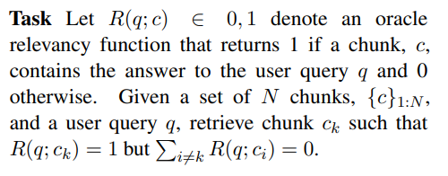

# Question-Based Retrieval using Atomic Units for Enterprise RAG

Keywords: LLM, RAG, Retrieval Augmentation
리뷰 진행 상태: 논문리뷰 진행중
진행 일시: 2024년 9월 5일
논문 주소: https://arxiv.org/pdf/2405.12363v2
구현 진행 상태: 시작 전
year: 2024

## **Title of the Paper**

Question-Based Retrieval using Atomic Units for Enterprise RAG

## **Goal of the Paper**:

- **Enterprise Retrieval-Augmented Generation (RAG)** 시스템의 성능을 개선하는 것
- 특히, 문서의 일부를 보다 효율적으로 검색하는 방법을 연구하여, 사용자 쿼리에 대해 더 정확한 문서 조각을 반환하는 것을 목표로 함.
- 이를 통해 잘못된 정보로 인한 오답을 줄이고, LLM(Large Language Model) 기반의 응답 생성을 향상시키고자 함

## **Contribution**:

- 문서를 **원자적 단위(atomic statements)**로 분해하여, 기존보다 더 높은 검색 성능을 달성
- 생성된 원자 단위에서 **synthetic questions(인공 질문)**을 생성하고, 이를 사용한 검색 기법을 제안
- **dense retrieval** 방식을 사용한 기존 검색 방법에 비해 원자 단위의 문서 표현을 통해 검색 성능을 향상

## Related Work

### RAG

- **분할(Split)**: 텍스트 문서의 말뭉치가 주어지면, 텍스트를 독립적인 문단으로 분할하여 **청크(chunks)**를 생성합니다.
- **검색(Retrieve)**: 사용자 쿼리가 주어지면, 해당 쿼리에 적합한 청크 집합을 검색합니다.
- **응답 생성(Synthesize)**: 원래 쿼리와 검색된 청크를 **생성 모델(synthesizer model)**에 전달하여, 제공된 청크 정보를 컨텍스트로 사용해 쿼리에 대한 응답을 생성

## **Methodology**:

- 기존 RAG의 Retrieval 단계를 개선하는데에 중점
- 이때 특정 쿼리에 대한 답변이 하나의 chunk에만 포함되어 있다고 가정함
- 이에 따라 Task를 다음과 같이 정의함

oracle relevancy function는 정보 검색 시스템에서 **이론적인 최적 상태**를 나타내는 함수로, 쉽게 말하면, 주어진 쿼리에 대해 **가장 관련성이 높은 문서나 청크**가 무엇인지 정확하게 알고 있는 **이상적인 판정자** 역할을 하는 함수. R(q;c) = 1일때 청크 c가 쿼리 q에 대한 답변을 포함하고 있다는 뜻임

### **Training Data**:

- **SQuAD** 및 **BiPaR**
- 위키피디아와 소설과 같은 다양한 출처에서 추출된 텍스트를 포함하며, 쿼리와 해당하는 문서 조각으로 구성됨

### **Inputs and Outputs**:

- 모델은 사용자 쿼리를 입력으로 받고, 해당 쿼리에 맞는 문서 조각(chunks)을 출력
- 여기서 문서 조각은 원자적 단위로 나뉘어 처리됨

### **Architecture**:

- **Document Chunking**: 먼저 문서를 독립된 조각으로 나누고, 각각의 문서 조각을 **원자적 정보(atomic statements)**로 분해
- 이때 **atomic statements** 란 chunk를 개별적인 사실적 단위로 분리한 것을 의미
- **Embedding**: 각 원자적 정보와 쿼리를 임베딩된 고차원 공간에서 비교되어 검색. 기본적으로, 문서 조각과 쿼리의 **코사인 거리(cosine distance)**를 최소화하는 방식으로 연관된 문서를 찾음
- **Synthetic Questions**: 각 원자적 정보에 대해 쿼리와 가장 일치하는 **인공 질문(synthetic questions)**을 생성하여, 더 높은 검색 성능을 달성

### cf. Standard vs Atomic

1. Standard
    1. 기본적인 dense retrieval 방식
    2. 모든 chunk와 query를 고차원 공간으로 임베딩
        
        
        
    3. 문서 조각과 쿼리 embedding의 cosine 거리를 계산해서 최소가 되는 문서 조각을 답으로 선택
        
        
        
    4. 한계:  쿼리의 의미적 임베딩 표현은 검색해야 할 청크의 의미적 임베딩 표현과 반드시 일치하지 않기 때문에 잘못된 청크가 검색될 수 있음
2. Generation Augmented Retrieval(GAG)
    1. 쿼리를 다른 문장 형태로 변형해 검색 기능 향상
    2. 예를 들어 쿼리 q인 ‘What is the capital of India?’를 ‘The capital of India is London’ q`로 바꾸는 등 쿼리를 정답과 유사한 형태의 hypothetical answer로 바꿔서 검색성능을 향상시킴
        
        
        
3. Atomic Retrieval
    1. 청크 내의 정보 조각들이 상이할 경우, 쿼리 임베딩이 정답을 포함한 청크 임베딩과 일치하지 않을 수 있으므로 청크를 atomic statements로 분해하여 각 atomic statements를 임베딩하고 이를 쿼리와 비교
    2. 문서 조각보다 더 작은 단위에서 검색을 수행하면서 더 높은 정확도 얻을 수 있음
        
        
        
4. Atomic Question Generation
    1. atomic statements에서 synthetic questions를 생성하여 쿼리와 일치하는 질문을 검색
    2. 각 atomic statements에서 질문을 생성하고, 그 질문과 쿼리의 임베딩을 비교해 가장 유사한 질문을 찾아내는 방식
        
        
        

### **Training Steps**:

- **zero-shot** 방식을 사용하여 별도의 추가 훈련 없이 임베딩 모델을 활용
- 각 쿼리와 문서 조각의 임베딩을 계산하고, 코사인 거리를 최소화하여 가장 적합한 문서 조각을 검색합니다.

### **Inference Steps**:

- 사용자 쿼리와 임베딩된 문서 조각의 원자 단위 정보를 비교
- 쿼리에 맞는 문서 조각이 선택된 후, 이 정보를 바탕으로 LLM이 최종 응답을 생성

### **Experiments**:

- 실험에는 **SQuAD**와 **BiPaR** 데이터셋이 사용되었습니다.

- **R@1(Recall at 1st result)**, **R@5(Recall in 5th results)** 등의 평가 지표를 통해 성능을 측정했으며, 원자 단위와 인공 질문을 사용하는 방법이 기존 방식보다 더 높은 검색 성능을 보였습니다.
- 예를 들어, SQuAD 데이터셋에서 원자적 질문을 사용했을 때, **R@1** 성능이 65.5%에서 76.3%로 향상되었습니다.

- **Atom-Structured**: **문장 단위**로 나누는 방식으로, 문장이 곧 하나의 원자적 정보 단위입니다. 문장이 명확하게 구분되는 상황에서 사용됩니다.
- **Atom-Unstructured**: **문장을 더 작은 정보 단위**로 나누는 방식으로, 문장 내부의 **의미적 정보**를 각각 분리해 더 세밀한 원자적 단위를 만듭니다. 복잡한 문장에서 유용합니다

### **Unique Creativity**:

- 문서를 **원자적 단위로 분해**하고, 각 원자적 단위에 대해 **인공 질문을 생성**하여 검색 성능을 향상시킨 점이 독창적입니다. 이 접근법은 기존의 chunk 단위 검색 방식을 넘어, 더 세밀하고 정확한 검색을 가능하게 합니다.

### **Limitations**:

- 이 연구는 하나의 쿼리가 단일 문서 조각에서만 답을 얻을 수 있다는 가정 하에 수행되었습니다. **다중 조각을 결합한 검색**이 필요할 경우 확장이 필요할 수 있습니다.
- 실험은 SQuAD와 BiPaR 데이터셋에만 적용되었으며, **더 큰 규모의 데이터셋**에서의 성능 검증이 추가적으로 필요합니다. 실제로 BiPaR (소설과 같이 허구적 이야기를 기반으로 한 데이터)를 활용한 실험에서는 성능 향상이 미비함

### **Important References**:

- Lewis et al. (2020). Retrieval-augmented generation for knowledge-intensive NLP tasks.
- Min et al. (2023). FactScore: Fine-grained atomic evaluation of factual precision in long-form text generation.
- Gao et al. (2023a). Precise zero-shot dense retrieval without relevance labels