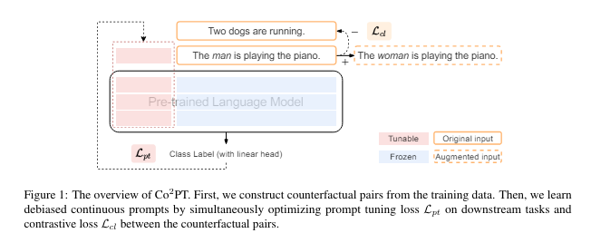

# Co2PT: Mitigating Bias in Pre-trained Language Models through Counterfactual Contrastive Prompt Tuning

keywords: Contrastive learning, Language Model, bias mitiation
conference: ACL
논문링크: https://aclanthology.org/2023.findings-emnlp.390.pdf
링크: https://github.com/dongxiangjue/Co2PT
발행년도: 2023
인용수: 3회
적용점: 특정 파라미터만 update하는 방식

# Abstract

언어 모델이 real world application에서 사용되는데 이러한 모델들은 large pre-training corpora로부터 social bias를 내포할 수 있으며 이는 downstream task에서 더 증폭될 수 있음

이러한 문제를 해결하기 위해 downstream task에서 **counterfactual contrastive prompt tuning** 를 적용해 편향을 완화시키는 방법인 Co2PT 제안

**cf. counterfactual contrastive prompt tuning**

- 원래 문장에서 특정 속성(예: 성별, 인종, 직업 등)을 변경하여 새로운 데이터를 생성하는 것

```markdown
 "The man is a doctor” >>  "The woman is a doctor”
```

**3가지 extrinsic benchmark dataset에서 실험을 수행**하여 Co2PT의 편향 완화 효과 및 기존의 upstream debiased language models에의 적용가능성을 보여줌

# Introduction

- 언어 모델이 real world application에서 사용되는데 이러한 모델들은 large pre-training corpora로부터 social bias를 내포할 수 있으며 이는 downstream task에서 더 증폭될 수 있음이 이전 연구에서 입증됨
- 예를 들어 언어 모델링 작업에서 "She is a nurse"가 "He is a nurse"보다 더 높은 조건부 가능성을 가질 수 있으며, 대명사 해소 작업에서 "nurse"가 "he"보다 "she"와 더 높은 coreference scores를 가질 수 있음
- 이전 연구의 경우, **대부분이 사전 학습 과정에서 학습된 표현을 debiasing하는데 초점**을 맞춤
    - through projection (Dev et al.,2020; Liang et al., 2020; Ravfogel et al., 2020;Kaneko and Bollegala, 2021)
    - further pre-training on unbiased external corpora (Webster et al., 2020; Lauscher et al., 2021; He et al., 2022)
    - finetuning to debias (Cheng et al., 2021; Guo et al.,2022).
    - SEAT intrinsic benchmark dataset:인구 통계 용어(예: woman, man)와 고정관념 용어(예: science, art) 간의 연관성을 계산하여, 편향이 없는 모델은 이러한 용어들의 표현 간에 차이가 없음을 나타냄
- **이러한 이전 연구 방식들의 경우 intrinsic bias evaluation에서 사회적 편향을 줄이는데 도움을 주지만, 이러한 debiasing-finetuning 방법은 upstream 모델에 편향이 없으면 fine tuning 과정에서도 공정성이 유지될 것이라는 가설에 기반하고 있음**
- 그러나 내적 벤치마크와 다운스트림 응용 프로그램에서 공정성을 평가하는 외적 벤치마크 간의 관계를 조사한 최근 연구에 따르면, 이 두 벤치마크 간의 상관관계가 약하다는 것을 발견(Kaneko et al., 2022). 하였으며 오히려 downstream task를 위한 fine tuning 과정에서 bias를 다시 습득하거나 증폭시키는 경향이 있음을 발견함(Zhao et al., 2017; Leino et al., 2019).
- 따라서 다운스트림 작업에서도 편향을 완화하기 위한 효율적이고 효과적인 방법을 제안하고자 하며 Co2PT를 제안함

# Related Works

debiasing을 위한 기존 related works

- **투영 기반 방법 (Projection-based methods)**:
    - Dev et al., 2020
    - Liang et al., 2020
    - Ravfogel et al., 2020
    - Kaneko and Bollegala, 2021
- **사후 텍스트 생성 기법 (Post-hoc text generation techniques)**:
    - Schick et al., 2021
- **적대적 방법 (Adversarial methods)**:
    - Han et al., 2021
- **편향된 프롬프트에 대한 미세 조정 (Fine-tuning on biased prompts)**:
    - Guo et al., 2022
- **대조 목표 사용 (Contrastive objective methods)**:
    - Cheng et al., 2021
    - Li et al., 2023
- **증강 데이터 사용 (Augmented data methods)**:
    - Zhao et al., 2018
- **반사실 데이터 증강을 통한 추가 사전 학습 (Counterfactual data augmentation for additional pre-training)**:
    - Webster et al., 2020
    - Lauscher et al., 2021
    - Meade et al., 2022
- **성별 균형 결론 쌍에 대한 대조 목표 사용 (Contrastive objective on gender-balanced entailment pairs)**:
    - He et al., 2022
- **드롭아웃 정규화 (Dropout regularization)**:
    - Webster et al., 2020
- **파라미터 효율적인 방법 (Parameter-efficient methods)**:
    - Lauscher et al., 2021
    - Yang et al., 2022
    - Xie and Lukasiewicz, 2023
- **외적 편향 벤치마크 (Extrinsic bias benchmarks)**:
    - SEAT (Sentence Encoding Association Test) - May et al., 2019
    - StereoSet - Nadeem et al., 2021
    - CrowS-Pairs - Nangia et al., 2020
- **내적 및 외적 평가 벤치마크 상관관계 연구 (Correlation between intrinsic and extrinsic evaluation bias benchmarks)**:
    - Goldfarb-Tarrant et al., 2021
    - Cao et al., 2022
    - Kaneko et al., 2022

- 대부분의 연구에서 모델의 내적 특성 내에서 편향을 완화하는 데 중점을 두며 편향 완화 정도를 내적 편향 벤치마트(SEAT 등)을 이용해 평가함
- 이후 디바이싱된 모델을 다운스트림 작업에 fine tuning하여 디바이싱된 모델이 언어 모델링 능력과 다운스트림 작업 또는 외적 편향 벤치마크에서의 성능을 유지함을 입증함
- 그러나 **최근 연구 결과, 이러한 debiasing - fine tuning 방식이 downstream task에 적용되면서 bais를 다시 습득하거나 증폭시킬 수 있으며,  내적 및 외적 평가 편향 벤치마크 간의 상관관계가 낮으므로 편향 완화를 다룰 때 외적 측정에 초점을 맞추도록 권장함** (Goldfarb-Tarrant et al., 2021; Cao et al., 2022; Kaneko et al., 2022)
- 따라서 본 연구에서는  다운스트림 작업에서의 편향 완화를 중점으로 하며, 외적 평가 벤치마크를 직접 사용하여 평가하고자 함. 또한 외부 코퍼스 접근이나 모델 재학습이 필요없는 방식이라 효율적임

# Co2PT: Debiasing via Counterfactual Contrastive Prompt Tuning



- Counterfactual Contrastive Prompt Tuning을 활용한 debiasing-prompt tuning 방식인 co2pt
- 훈련 데이터에서 지배적인 그룹 또는 소수 그룹과 관련된 인구 통계 용어를 반대 그룹을 나타내는 용어로 대체하여 counterfactual pairs를 제작함
- counterfactual pairs간 contrastive objective를 통해 프롬프트 매개변수에 대한 편향 완화 능력 통합
- 이때 PLM의 모든 매개변수는 고정하고 각 레이어에 튜닝 가능한 연속 프롬프트를 추가하여 parameter update
- Co2PT는 기존의 debiasing model에 통합되어 다운스트림 작업에서 편향을 완화하는 데 도움이 되며, 다양한 종류의 편향을 해결하는 데 유연성을 제공하여 다음과 같은 기여를 함.
    - **시간과 메모리 효율성**: 외부 코퍼스에 접근하거나 전체 모델을 재학습할 필요가 없음
    - 다운스트림 작업의 프롬프트 튜닝 과정에서 증폭된 편향을 효과적으로 완화
    - 기존 debiasing LM에서 **확장 사용 가능함**

### 1. Deep Prompt Tuning

- Co2PT의 백본 프레임워크
- PLM의 모든 레이어에 접두사 토큰으로 연속적인 프롬프트를 통합함으로서 파라미터 효율성을 유지하면서도 더 많은 tunable parameter를 갖게 됨(Li and Liang, 2021; Liu et al., 2022; Wang et al., 2022; Dong et al., 2023a).
- 이러한 방식은 입력 임베딩 레이어에만 학습 가능한 연속 프롬프트를 추가하는 방법(Lester et al., 2021; Liu et al., 2021)보다 우수한 성능을 달성할 수 있음(Liu et al., 2022)
- co2pt의 downstream task에서의 prompt tuning loss 는 $L_{pt}$로 표현되며 각 downstream task의 종류에 따라 다름

### 2. Counterfactual Pairs Construction

- 연속 프롬프트에 디바이싱 기능을 어떻게 주입할 것인가?
- counterfactual data augmentation를 이용해 데이터를 증강
- S가 훈련 코퍼스를 나타내고, W = {(w1, w2, ..., wm)i}N_i=1가 N개의 편향 속성 용어 쌍의 집합이라고 하자. 각 문장 si에서 s와 W의 각 쌍 (w1, w2, ..., wm)에 대해, s의 모든 wi를 반대 편향 방향의 용어로 대체
    - 예를 들어 **"The man is playing the piano"(s_i)**라는 입력 문장에서 "man"을 "woman"으로 대체하고 비속성 단어는 변경하지 않으며 결국 증강된 문장은 **"The woman is playing the piano”(s’_i)**가 됨

### 3. Counterfactual Contrastive Learning

- 2에서 생성한 pair는 편향 속성 용어를 포함하는 입력의 균형을 맞추는 데 도움이 됨
- 유사한 의미를 가지지만 다른 편향 방향을 가진 문장은 더 가까워야 하기 때문
- **contrastive learning을 적용하여 의미적으로 유사한 이웃을 더 가깝게 하고, 유사하지 않은 이웃을 더 멀리 밀어내고자 함**(Gao et al., 2021; Dong et al., 2023b; Li et al., 2023)
- s_i와 s’_i의 representation인 h_i, h’_i를 생성하고 이를 연속 프롬프트 p와 결합하여 positive pair로 사용함
- 이에 대해 아래 loss function을 사용함
    
    
    

### 4. Learning Objectives

- prompt tuning loss 인 $L_{pt}$와 contrastive learning의 $L_{cl}$를 동시에 최적화
- $L = L_{pt} + \alpha L_{cl}$
- PLM의 파라미터는 고정된 상태이므로  Counterfactual Contrastive Learning 이후 debiasing knowledge는 debiasing-prompt 파라미터만 조정된다
- 이를 통해 원래 PLM의 파라미터 내 지식을 유지하고 다양한 downstream task에 유연하게 적용할 수 있다

# Experiments

### 1. Experiments setup

Co2PT의 성능을 확인하기 위해 아래 4가지 질문을 중심으로 실험을 설계

- **RQ1**: Co2PT가 다운스트림 작업에서 편향을 효과적으로 완화할 수 있는가?
- **RQ2**: Co2PT와 결합했을 때 기존의 intrinsic 디바이싱 방법들이 다운스트림 작업에서 어떻게 성능을 발휘하는가?
- **RQ3**:  Co2PT의 각 구성 요소가 Co2PT 성능에 미치는 영향은 무엇인가?
- **RQ4**: 하이퍼파라미터가 Co2PT에 미치는 영향은 무엇인가?

### 2. bias evaluation

- 기존에 extrinsic bias evaluation에서 사용되는 3개 벤치마크를 이용해 평가
- Bias-STS-B, Bias-NLI, Bias-in-Bios:직업에서의 성별 상관성 평가 가능

### 3. Datasets and Setup

모델을 SNLI(Semantic Textual Similarity Benchmark)와 STS-B(Natural Language Inference) 데이터셋을 이용해 fine tuning을 수행하고, validation 기준 모델 선택해 이를 Bias-STS-B와 Bias-NLI를 이용해 편향 평가함

### 4. baseline

- 6개 upstream debiased models,
    - **ZariCDA (Webster et al., 2020)**:  counterfactual data augmented English Wikipedia dataset으로 pretraining 수행
    - **ZariDO (Webster et al., 2020): ZariCDA와 동일한 데이터셋으로 pretraining, 추가적으로 dropout 비율 증가시킴**
    - **ADELE 및 ADELE-TA (Lauscher et al., 2021)**: counterfactual data augmented corpus에 masked language modeling을 적용함으로서 debiased adapters를 주입하고 학습
    - **Context-Debias (Kaneko and Bollegala, 2021)**: inner product loss와 squared distance loss를 이용해 fine tuning 수행
    - Auto-Debias (Guo et al., 2022): beam search를 이용해 biased prompt를 검색한 뒤 이를 예측된 [MASK] 토큰 분포 간의 불일치를 최소화에 사용함으로서 PLM의 fine tuning에 사용
    - **MABEL (He et al., 2022)**: SNLI 및 MNLI 데이터에서 성별 용어가 포함된 entailment pairs에 대해 contrastive loss, alignment loss, optional masked language modeling loss를 사용해 추가적 pre-training 수행
- 3개 baseline(fine-tuning or prompt-tune BERT)
    - **BERT (Devlin et al., 2019)**:
    - **BERT+CDA**:  counterfactually augmented dat로 fine tuning된 BERT
    - **PT (Liu et al., 2022)**: 모델의 각 layer에 continuous prompt를 추가하고 downstream task에서 튜닝

# Debiasing Effectiveness (RQ1)

Co2PT가 다운스트림 작업에서 편향을 효과적으로 완화할 수 있는가?

### 1. Bias-STS-B

모든 메트릭에서 가장 낮은 편향 점수를 보이며, 다른 디바이싱 기준 모델들과 유사한 다운스트림 작업 성능을 달성


- Diff.↓ (Average Absolute Difference): 성별 용어가 포함된 문장 쌍의 유사도 점수의 평균 절대 차이. 낮을수록 편향 적음
- τ :r↓ (Proportion of Sentence Pairs with Absolute Difference > r): 성별 용어가 포함된 문장 쌍의 유사도 점수 차이가 r을 초과하는 경우의 비율. 낮을수록 편향된 문장 쌍의 비율이 적은 것
- Pear. / Spear. (Pearson and Spearman Correlation): 두 용어간 유사도

### 2. Bias-NLI


- **NN↑ (Net Neutral)**: 모델이 할당한 중립 라벨의 평균 확률. 높을수록 모델이 편향 없이 중립 라벨을 잘 예측하고 있음을 나타냄
- **FN↑ (Fraction Neutral)**: 모델이 중립 라벨을 예측한 인스턴스 비율. 높을 수록 모델이 편향 없이 중립 라벨을 잘 예측하는것
- **T:r↑ (Threshold: r)**: 중립 확률이 r을 초과하는 예제의 비율. 높을수록 중립 라벨을 더 잘 예측하는 것

### 3. Bias-in-Bios


- **GAPTPR↓ (Difference in True Positive Rates)**: 다양한 직업에서 성별 간의 진양성률(TPR)의 차이. 낮을 수록 공정함을 의미
- **GAPRMS↓ (Root Mean Square of TPR Gender Gap)**: 모든 직업에서 직업별 TPR 성별 격차의 제곱 평균 근(RMS). 낮을수록 TPR 차이 최소화함을 의미

# Integrating Co2PT with Existing Debiased Models (RQ2)

Co2PT와 결합했을 때 기존의 intrinsic 디바이싱 방법들이 다운스트림 작업에서 어떻게 성능을 발휘하는가?

Co2PT와 기존 debiasing 방법 결합한 결과, MABEL 제외 편향 점수 크게 감소

- Co2PT는 기존의 내재적 편향 완화 방법들과 결합했을 때도 우수한 성능을 유지함.
- Bias-STS-B, Bias-NLI, Bias-in-Bios 데이터셋에서 Co2PT와 기존 방법을 결합한 모델이 더 낮은 편향 점수를 기록함.
- 이는 Co2PT가 다른 디바이싱 방법들과 결합하여도 성능이 유지되거나 향상될 수 있음을 시사함.


# Impact of Design (RQ3)

 Co2PT의 각 구성 요소가 Co2PT 성능에 미치는 영향은 무엇인가?

Impact of counterfactual module.

Impact of contrastive module.

Impact of adding contrastive loss for nonaugmented inputs

Compare Co2PT with task-agnostic counterfactual pairs.

Compare Co2PT with other contrastive objective

- **Pooling Method**: CLS 토큰을 사용하는 것이 평균 토큰 표현을 사용하는 것보다 더 나은 성능을 보임.
- **Counterfactual Pairs**: Counterfactual 데이터 증강을 통해 생성된 쌍이 편향을 효과적으로 완화함.
- **Contrastive Learning**: 의미적으로 유사한 문장을 더 가깝게, 유사하지 않은 문장을 더 멀리 위치시키도록 학습하여 편향을 줄임.
- Ablation study 결과, 각 모듈이 Co2PT의 성능에 중요한 기여를 함.

# Impact of Hyperparameters (RQ4)

하이퍼파라미터가 Co2PT에 미치는 영향은 무엇인가?

Impact of prompt length.

Impact of τ .

Impact of α.

- **Prompt Length**: 프롬프트 길이가 길수록 Co2PT의 성능이 향상됨.
- **Temperature (τ)**: 대조 학습 손실의 온도 τ 값이 적절히 설정될 때 성능이 향상됨.
- **Coefficient (α)**: 전체 학습 목표의 계수 α 값이 성능에 영향을 미침.
- 하이퍼파라미터 튜닝을 통해 Co2PT의 성능을 최적화할 수 있음을 입증함.

# Conclusion and Future Work

### Contribution

- extrinsic bias benchmark에서의 강력한 편향 완화 효과
- 각 구성 요소가 Co2PT 성능에 미치는 영향 분석

### Future work

- 성별 외 다른 bias 유형에 대해서도 Co2PT 적용하기
- 실제 응용에서의 적용 가능성 탐구

## Limitation

- 주로 영어에서의 bias를 다루는데, 다른 언어에서 다른 복잡한 형태의 bias case가 존재할 수 있음
- prompt tuning의 경우 효율적이지만, 모델의 크기가 작을 때 여전히 fine tuning보다 성능이 떨어지므로 Co2PT 또한 모델 크기가 작은 경우 성능이 떨어질 수 있음